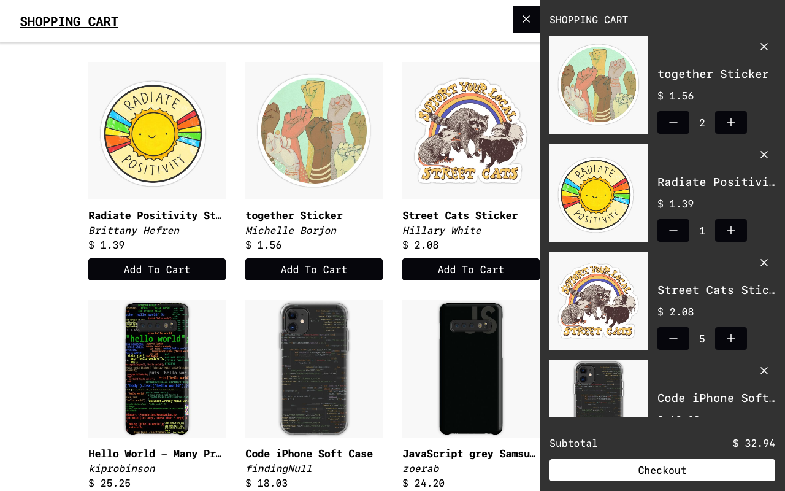

# Shopping Cart - [Live Demo](https://rafael-almeida-shopping-cart.netlify.app/)

A simple shopping cart built with React and Redux.

  

## Features

- Fetch data from an API
- Add/remove products to/from the shopping bag
- Responsive design

## Technologies

- [React](https://reactjs.org/)
- [Redux](https://redux.js.org/)
- [CSS Modules](https://github.com/css-modules/css-modules)
- [My JSON Server](https://my-json-server.typicode.com/)

## Todo

- [ ] Filter products
- [ ] Sort products by price
- [ ] Persist shopping bag after page reloads
- [ ] Implement product ratings

## [License]("./LICENSE")

MIT License
